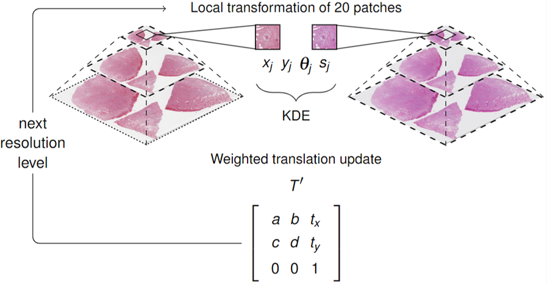

# CrossScannerRegistration

CrossScannerRegistration is a python package that provides functionality for cross-scanner registration of pathology 
images, presented in: 

> Luisa Theelke, Frauke Wilm, Christian Marzahl, Christof A Bertram, Robert Klopfleisch, Andreas Maier, Marc Aubreville,
 Katharina Breininger "Iterative Cross-Scanner Registration for Whole Slide Images" (2021).
[ICCV CDpath](https://openaccess.thecvf.com/content/ICCV2021W/CDPath/papers/Theelke_Iterative_Cross-Scanner_Registration_for_Whole_Slide_Images_ICCVW_2021_paper.pdf) 

     
<p float="left">
  
</p>
     
## Features

- Cross-scanner registration of pathology images
- Support for all openslide-compatible image formats
- Easy-to-use command line interface (CLI)

## Installation

1. Clone the repository:

   ```console
   git clone https://github.com/DeepPathology/CrossScannerRegistration.git
   ```

2. Navigate to the project directory:

   ```console
   cd CrossScannerRegistration
   ```
   
3. Install the required dependencies:

   ```console
   pip install -r requirements.txt
   ```
   
## Usage
   ```console
   python registration.py --source <path_to_source_image> --target <path_to_target_image>
   ```
   
Replace **<path_to_source_image>** with the path to the source image, and **<path_to_target_image>** with the path to 
the target image. 

## Contributing
Contributions are welcome! If you find any bugs or have suggestions for improvement, please open an issue or submit a 
pull request. Make sure to follow the project's code of conduct.